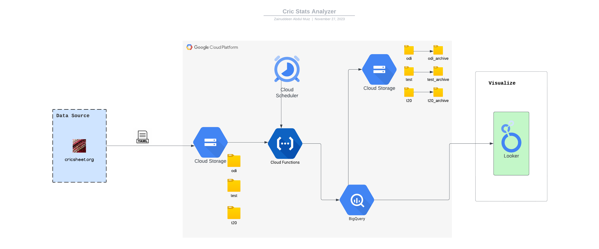

# <h1 align="center"> Cric Stats Analyzer 🏏 </h1>

A repository that holds codes, schemas and sql queries for Cricket Statistics Analyzer.

## Getting Started with Cric Stats Analyzer

### Overview

Cric Stats Analyzer is a comprehensive tool designed to analyze historical cricket matches played in the ODI, T20, and Test formats (Mens). The objective is to load match data from [Cricsheet](https://cricsheet.org/), perform data transformations, and store it efficiently in BigQuery. The project aims to provide statistical reports, metrics, and dashboards, emphasizing the top 50 batsmen, bowlers, and all-rounders of all time. The solution prioritizes cost-efficiency and optimal query performance.

## Project Structure

The project is organized into three main components:

1. **[Cloud Function](./cloud_function/) (`to_bq.py`):**

   - Orchestrates the ETL process.
   - `.env`: Environment variable configuration.
   - Read [`README.md`](./cloud_function/README.md): Documentation providing an overview of the Cloud Function.

2. **[Schema](./schema/README.md):**

   - `tables`: Schema definitions for BigQuery tables.
   - `views`: Schema definitions for virtual views.

3. **[SQL Scripts](./sql/):**
   - `DDL`: Data Definition Language (DDL) scripts for view creation.
   - `DML`: Data Manipulation Language (DML) scripts for data manipulation.

## Setup Steps

1. **Cloud Function (`to_bq.py`):**

   - Clone the repository to your local machine.
   - Review and update environment variables in the `.env` file.
   - Ensure required Python libraries are installed using `pip install -r requirements.txt`.

2. **Schema (`schema` folder):**

   - Explore schema files in the `tables` and `views` directories for detailed structure information.
   - Make any necessary updates to the schema based on project requirements.

3. **SQL Scripts (`sql` folder):**
   - Review DDL scripts for view creation.
   - Examine DML scripts for data manipulation.
   - Execute scripts in the desired order for setting up the BigQuery environment.

## Functionality

- **Load Data into BigQuery Tables:**

  - Ingest historical cricket match data into separate BigQuery tables based on match types (ODI, T20, Test).

- **Source Data from Match Files:**

  - Retrieve data from Match files stored in a Google Cloud Storage (GCS) bucket.

- **Statistical Reports, Metrics, Dashboards:**

  - Generate statistical reports, metrics, and dashboards over BigQuery tables.
  - Focus on creating specific reports for the top 50 batsmen, bowlers, and all-rounders of all time.

- **Cost-Efficient Solution:**

  - Develop a cost-efficient solution for data processing and storage.

- **Optimal Query Performance:**
  - Ensure optimal performance for queries over the BigQuery tables.

## Architecture

1. **Data Ingestion:**

   - A new data file is dropped into the GCS bucket.

2. **Trigger Mechanism:**

   - Cloud Scheduler triggers the Cloud Function periodically to check for files in the GCS bucket.

3. **Data Processing Workflow:**

   - The data processing workflow parses YAML (or CSV, XML, JSON) data.
   - Performs data transformations.
   - Loads the transformed data into BigQuery tables.

4. **Archive Folder:**

   - On successful data ingestion, files in GCS bucket are moved to the archive folder.

5. **Generating Views:**

   - Views are generated using BigQuery.

6. **Dashboards in Looker:**
   - Projected to Dashboards in Looker for visualization and analysis.

## Services Used

- **Google Cloud Storage (GCS):**

  - Storage service for holding historical cricket match data in various formats.

- **Cloud Scheduler:**

  - Periodically triggers the Cloud Function to check for new data files in the GCS bucket.

- **Cloud Function:**

  - Executes the ETL process, parsing, transforming, and loading data into BigQuery.

- **BigQuery:**

  - Data warehouse for storing cricket match statistics and enabling powerful querying.

- **Looker:**

  - Platform for building dashboards and visualizing insights from the generated views in BigQuery.

- **GCS Secret Manager:**
  - Accesses secrets from Google Cloud Secret Manager.

By following these setup steps, you can initiate and configure the Cric Stats Analyzer project for efficient cricket statistics analysis.
